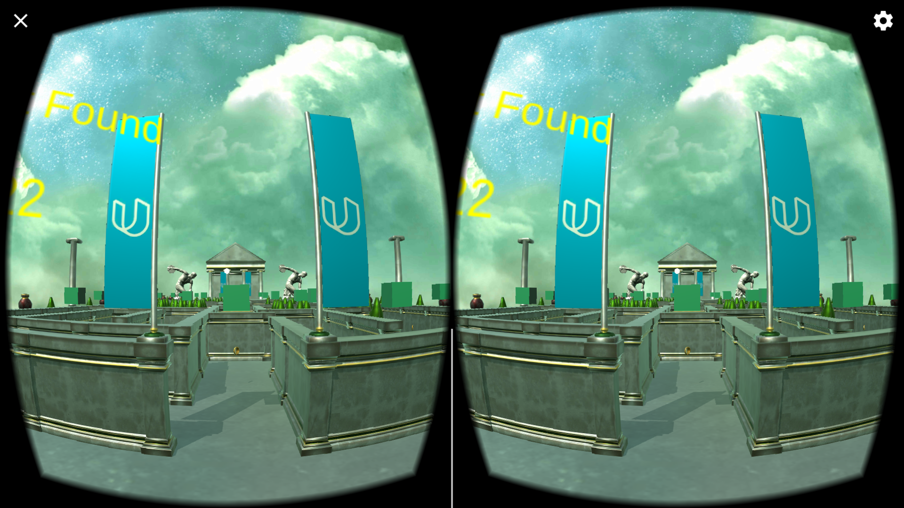
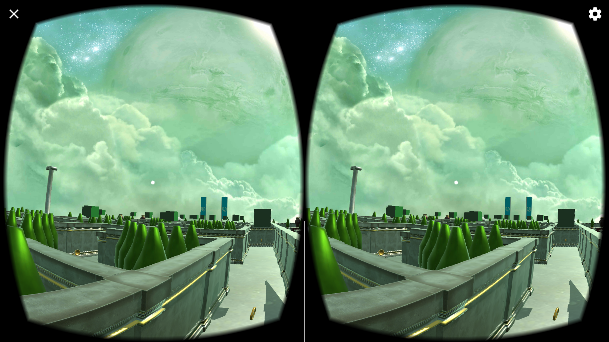
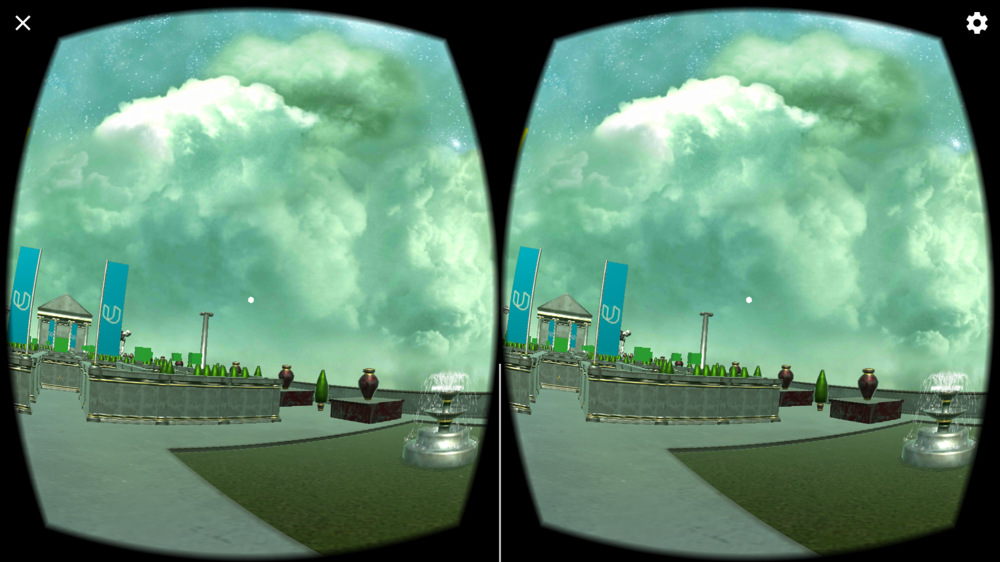
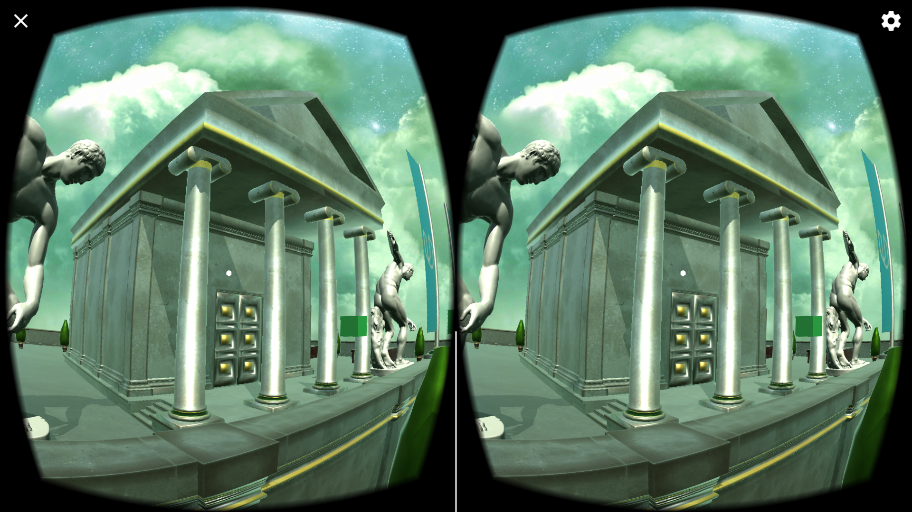
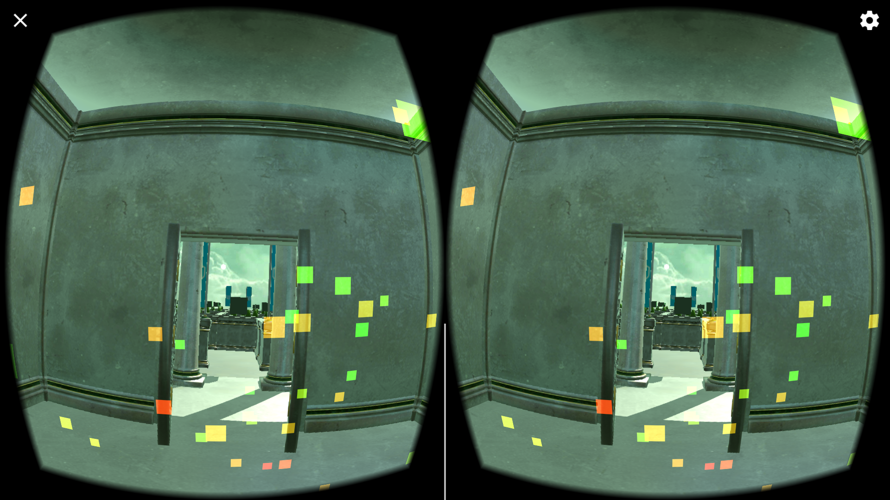

#Desription
This is a VR maze environment to play in android and ios devices. This project is created with the help of Google VR SDK.

##Main Features
* Movement is controlled by the waypoints created throughout the environment
* Every collectable can be interacted with
* The maze can only be completed by collecting the key and opening the chest'
* Particle system which enhances the look of whole setup

##Screenshots

##Steps to run project
1. Import Google VR SDK
2. Clone the repository in working directory
3. Open VR-Maze-Scene.unity from Scene folder

##Downloads
* Google VR SDK - [ver 1.0](https://github.com/googlevr/gvr-unity-sdk/releases/tag/v1.0.0)
* You can download the apk from [here](https://github.com/manjogsingh/VR-Maze/releases/download/v1.0.0)

##Author
**Manjog Singh**
* Testing Device - Oneplus 3 (Android Nougat 7.1.1)
* Time taken - 1.5 weeks
* Challenging task - To recreate the whole maze setup
* Best part - The feeling of standing in a virtual realistic environment